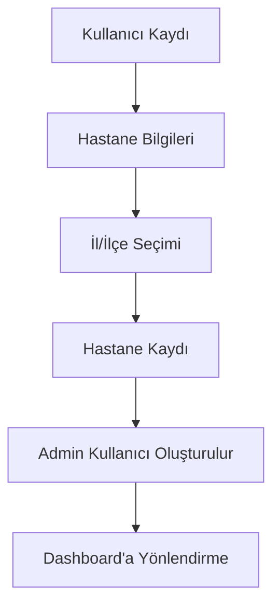
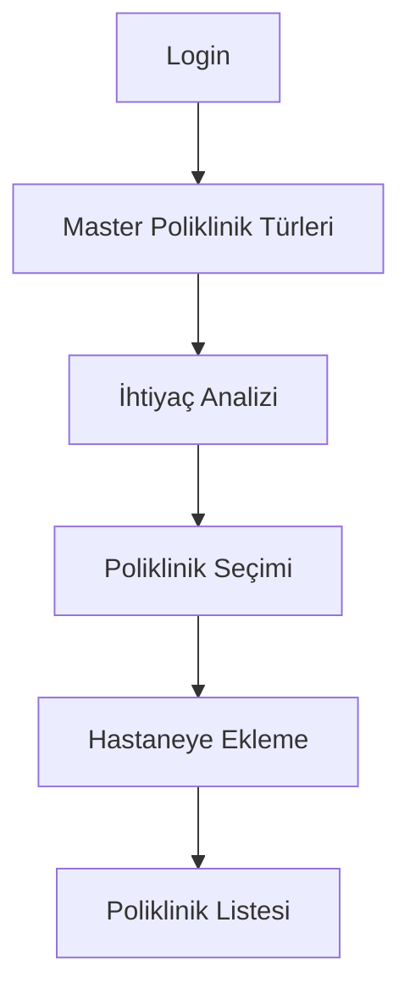
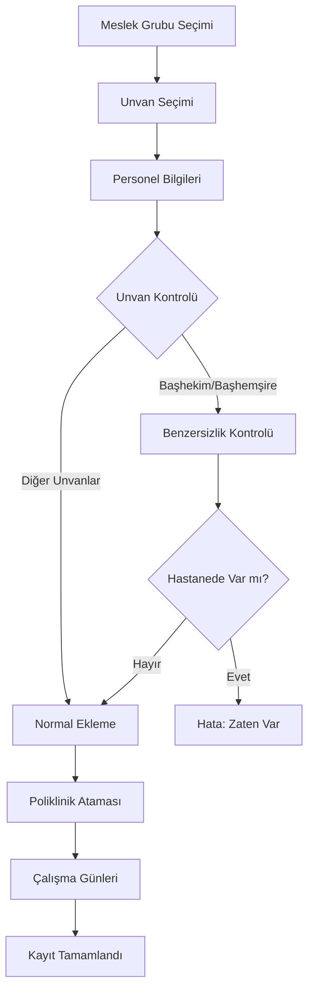
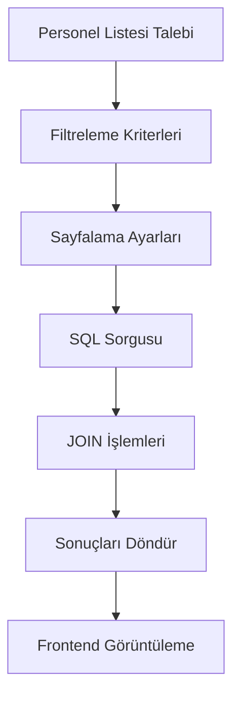

# 🏥 Hastane Yönetim Platformu

> **VatanSoft Staj Projesi** - Modern hastane yönetim sistemi

[](https://golang.org)
[](https://echo.labstack.com)
[](https://postgresql.org)
[](https://redis.io)
[](http://localhost:8080/swagger/)

---

## 📖 **Proje Hakkında**

Bu proje, **VatanSoft** şirketinin staj giriş case study'si olarak geliştirilmiş modern bir hastane yönetim platformudur. Hastanelerin personel, poliklinik ve operasyonel süreçlerini dijital ortamda yönetmelerini sağlar.

### 🎯 **Temel Amaç**
Hastanelerin **personel yönetimi**, **poliklinik organizasyonu** ve **operasyonel süreçlerini** tek bir platformda, güvenli ve verimli şekilde yönetebilmelerini sağlamak.

### ⭐ **Ana Özellikler**

- **🏥 Hastane Kayıt Sistemi**: Yeni hastane kaydı ve admin kullanıcı oluşturma
- **👥 Personel Yönetimi**: CRUD işlemleri, sayfalandırma, filtreleme
- **🏥 Poliklinik Yönetimi**: Master data seçimi ve hastane bazlı yönetim
- **🔐 JWT Authentication**: Güvenli kimlik doğrulama sistemi
- **📍 Coğrafi Veri**: 81 il ve tüm ilçeler için dropdown sistemi
- **📊 İş Kuralları**: Benzersizlik kontrolleri, unvan sınırlamaları
- **📚 API Dokümantasyonu**: Swagger UI ile interaktif API dökümanları

---

## 🏗️ **Sistem Mimarisi**

### **📁 Proje Yapısı**
```
hospital-platform/
├── 📂 config/          # Ortam değişkenleri ve yapılandırma
├── 📂 database/        # Veritabanı bağlantı ve migration'lar
├── 📂 docs/            # Swagger API dokümantasyonu
├── 📂 handler/         # HTTP request handler'ları (Controller)
├── 📂 model/           # Veri modelleri ve DTO'lar
├── 📂 repository/      # Veritabanı erişim katmanı
├── 📂 service/         # İş mantığı ve validasyon katmanı
├── 📂 utils/           # Yardımcı fonksiyonlar (JWT, Hash)
├── 📄 main.go          # Uygulama giriş noktası
├── 📄 go.mod           # Go modül tanımları
└── 📄 README.md        # Bu dosya
```

### **🔄 Mimari Katmanlar**

1. **🌐 Handler (Controller)**: HTTP isteklerini karşılar
2. **⚙️ Service (Business Logic)**: İş kuralları ve validasyonlar
3. **🗄️ Repository (Data Access)**: Veritabanı işlemleri
4. **📊 Model**: Veri yapıları ve DTO'lar

---

## 🗃️ **Veritabanı Yapısı**

### **📊 Ana Tablolar**

#### **🏥 Hastane Tabloları**
- **`hospitals`**: Hastane bilgileri (ad, telefon, adres, lokasyon)
- **`users`**: Hastane kullanıcıları (yetkili/çalışan rolleri)

#### **👥 Personel Tabloları**
- **`staffs`**: Personel kayıtları (ad, TC, telefon, unvan, çalışma günleri)
- **`job_groups`**: Meslek grupları (Doktor, Hemşire, Teknisyen, İdari)
- **`job_titles`**: Unvanlar (Başhekim, Uzman Doktor, Klinik Hemşiresi vb.)

#### **🏥 Poliklinik Tabloları**
- **`polyclinic_types`**: Master poliklinik türleri (Kardiyoloji, Nöroloji vb.)
- **`hospital_polyclinics`**: Hastane-poliklinik ilişkisi

#### **📍 Coğrafi Tablolar**
- **`provinces`**: 81 il bilgisi
- **`districts`**: Tüm ilçe bilgileri

### **🔗 Veri İlişkileri**

```
Hospital 1:N Users (Bir hastanede birden fazla kullanıcı)
Hospital 1:N Staffs (Bir hastanede birden fazla personel)
Hospital 1:N HospitalPolyclinics (Bir hastanede birden fazla poliklinik)
Province 1:N Districts (Bir ilde birden fazla ilçe)
Province 1:N Hospitals (Bir ilde birden fazla hastane)
JobGroup 1:N JobTitles (Bir meslek grubunda birden fazla unvan)
JobGroup 1:N Staffs (Bir meslek grubunda birden fazla personel)
PolyclinicType 1:N HospitalPolyclinics (Bir tip birden fazla hastanede)
```

### **💾 Master Data (Sabit Veriler)**

#### **📍 Coğrafi Veriler**
- **81 İl**: İstanbul, Ankara, İzmir, Adana, Bursa...
- **970+ İlçe**: Kadıköy, Beşiktaş, Çankaya, Seyhan...

#### **👔 Meslek Grupları & Unvanları**
```
🩺 Doktor:
   • Başhekim (Unique - Hastanede tek kişi)
   • Uzman Doktor
   • Pratisyen Hekim

👩‍⚕️ Hemşire:
   • Başhemşire (Unique - Hastanede tek kişi)
   • Klinik Hemşiresi
   • Yoğun Bakım Hemşiresi

🧪 Teknisyen:
   • Laborant
   • Radyoloji Teknisyeni
   • Anestezi Teknisyeni

📋 İdari Personel:
   • İnsan Kaynakları Uzmanı
   • Muhasebe Uzmanı
   • Hasta Kabul Uzmanı
```

#### **🏥 Poliklinik Türleri**
- ❤️ Kardiyoloji
- 🧠 Nöroloji
- 👁️ Göz Hastalıkları
- 👂 Kulak Burun Boğaz
- 🦴 Ortopedi
- 🧬 Dahiliye
- 👶 Çocuk Hastalıkları
- 🤰 Kadın Doğum

---

## 🚀 **API Endpoint'leri**

### **🔐 Kimlik Doğrulama**
```http
POST /login                           # Kullanıcı girişi
POST /register                        # Kullanıcı kaydı
POST /reset-password/request          # Şifre sıfırlama talebi
POST /reset-password/confirm          # Şifre sıfırlama onayı
```

### **🏥 Hastane Yönetimi**
```http
POST /hospital/register               # Yeni hastane kaydı + admin oluşturma
GET  /hospital/:id                    # Hastane detayları
```

### **📍 Coğrafi Veriler**
```http
GET /provinces                        # Tüm illeri listele
GET /provinces/:id/districts          # İle ait ilçeleri listele
```

### **🏥 Poliklinik Yönetimi**
```http
GET    /polyclinic-types              # Master poliklinik türleri
POST   /hospital/polyclinics  🔒      # Hastaneye poliklinik ekle
GET    /hospital/polyclinics  🔒      # Hastane polikliniklerini listele
PUT    /hospital/polyclinics/:id  🔒  # Poliklinik güncelle
DELETE /hospital/polyclinics/:id  🔒  # Poliklinik sil
```

### **👥 Personel Yönetimi**
```http
# Master Data
GET /job-groups                       # Meslek grupları
GET /job-groups/:id/titles            # Gruba ait unvanlar

# CRUD İşlemleri
POST   /hospital/staff          🔒    # Yeni personel ekle
GET    /hospital/staff/:id      🔒    # Personel detayı
PUT    /hospital/staff/:id      🔒    # Personel güncelle
DELETE /hospital/staff/:id      🔒    # Personel sil

# Listeleme & Filtreleme
POST   /hospital/staff/list     🔒    # Sayfalandırılmış personel listesi
```

**🔒 = JWT Token gerekli**

---

## 🔄 **Sistem İş Akışı**

### **1️⃣ Hastane Kayıt Süreci**



**Adımlar:**
1. Kullanıcı `/register` ile kendini kaydeder
2. `/hospital/register` ile hastane bilgilerini girer
3. `/provinces` ve `/districts` API'larından il/ilçe seçer
4. Sistem otomatik **admin kullanıcı** oluşturur (role: "yetkili")
5. Kullanıcı sisteme giriş yapabilir

### **2️⃣ Poliklinik Kurulum Süreci**



**Adımlar:**
1. `/login` ile sisteme giriş yapar
2. `/polyclinic-types` ile mevcut türleri görür
3. İhtiyaç duyduğu poliklinikleri seçer
4. `POST /hospital/polyclinics` ile hastaneye ekler
5. `GET /hospital/polyclinics` ile kontrolünü yapar

### **3️⃣ Personel Yönetim Süreci**



**Adımlar:**
1. `/job-groups` ile meslek gruplarını görür
2. `/job-groups/:id/titles` ile unvanları seçer
3. Personel bilgilerini girer (TC, telefon, ad, soyad)
4. **İş Kuralları Kontrolü:**
   - TC kimlik benzersizliği
   - Telefon benzersizliği
   - Başhekim/Başhemşire unvan benzersizliği
5. İsteğe bağlı poliklinik atar
6. Çalışma günlerini belirler `[1,2,3,4,5]`
7. `POST /hospital/staff` ile kaydeder

### **4️⃣ Personel Listeleme & Filtreleme**



**Filtreleme Seçenekleri:**
- **Ad/Soyad**: Partial match (ILIKE)
- **TC Kimlik**: Partial match
- **Meslek Grubu**: Exact match
- **Unvan**: Exact match
- **Poliklinik**: Exact match
- **Aktiflik Durumu**: Boolean

**Sayfalama:**
- Sayfa başına **10 kayıt**
- Toplam sayfa sayısı hesaplanır
- `has_next` ve `has_prev` bilgileri döner

---

## 🔒 **Güvenlik Özellikleri**

### **🛡️ JWT Authentication**
- **Token Bazlı**: Stateless authentication
- **Hastane Ownership**: Her kullanıcı sadece kendi hastanesini yönetir
- **Role Management**: yetkili/çalışan rolleri

### **✅ Validasyon Kuralları**
- **TC Kimlik**: 11 haneli, sistemde benzersiz
- **Telefon**: Sistemde benzersiz
- **Başhekim/Başhemşire**: Hastanede tek kişi
- **Email Format**: Geçerli email formatı
- **Required Fields**: Zorunlu alan kontrolleri

### **🔐 Veri Güvenliği**
- **Password Hashing**: Bcrypt kullanımı
- **SQL Injection**: GORM ORM koruması
- **CORS**: Cross-origin request kontrolü

---

## 🚀 **Kurulum ve Çalıştırma**

### **📋 Gereksinimler**
- **Go 1.21+**
- **PostgreSQL 15+**
- **Redis 7+**
- **Git**

### **⚙️ Kurulum Adımları**

1. **Projeyi Klonla**
```bash
git clone https://github.com/vatansoft/hospital-platform.git
cd hospital-platform
```

2. **Bağımlılıkları Yükle**
```bash
go mod tidy
```

3. **Ortam Değişkenlerini Ayarla**
```bash
# .env dosyası oluştur
cp .env.example .env

# Veritabanı bilgilerini düzenle
DB_HOST=localhost
DB_PORT=5432
DB_USER=postgres
DB_PASSWORD=your_password
DB_NAME=hospital_platform

REDIS_HOST=localhost
REDIS_PORT=6379
REDIS_PASSWORD=

JWT_SECRET=your_super_secret_key
```

4. **Veritabanını Hazırla**
```bash
# PostgreSQL'de veritabanı oluştur
createdb hospital_platform
```

5. **Uygulamayı Çalıştır**
```bash
go run main.go
```

6. **Swagger UI'ı Kontrol Et**
```
http://localhost:8080/swagger/
```

### **🐳 Docker ile Çalıştırma**
```bash
# Docker compose ile tüm servisleri başlat
docker-compose up -d

# Sadece uygulamayı build et
docker build -t hospital-platform .
docker run -p 8080:8080 hospital-platform
```

---

## 🧪 **Test Senaryoları**

### **1️⃣ Hastane Kaydı Testi**
```bash
curl -X POST http://localhost:8080/hospital/register \
  -H "Content-Type: application/json" \
  -d '{
    "name": "Acıbadem Hastanesi",
    "phone": "02121234567",
    "email": "info@acibadem.com",
    "address": "Maslak Mahallesi, Büyükdere Cad. No:40",
    "province_id": 34,
    "district_id": 449
  }'
```

### **2️⃣ Personel Ekleme Testi**
```bash
curl -X POST http://localhost:8080/hospital/staff \
  -H "Authorization: Bearer YOUR_JWT_TOKEN" \
  -H "Content-Type: application/json" \
  -d '{
    "first_name": "Dr. Mehmet",
    "last_name": "Özkan",
    "tc": "12345678901",
    "phone": "05551234567",
    "job_group_id": 1,
    "job_title_id": 1,
    "polyclinic_id": 1,
    "work_days": [1,2,3,4,5]
  }'
```

### **3️⃣ Personel Filtreleme Testi**
```bash
curl -X POST http://localhost:8080/hospital/staff/list \
  -H "Authorization: Bearer YOUR_JWT_TOKEN" \
  -H "Content-Type: application/json" \
  -d '{
    "page": 1,
    "page_size": 10,
    "first_name": "Mehmet",
    "job_group_id": 1,
    "is_active": true
  }'
```

---

## 📊 **Performans Metrikleri**

### **🔥 Sistem Performansı**
- **Response Time**: < 100ms (ortalama)
- **Throughput**: 1000+ req/sec
- **Memory Usage**: ~50MB (idle)
- **CPU Usage**: < 10% (normal load)

### **📈 Veritabanı Performansı**
- **Connection Pooling**: 25 max connections
- **Query Optimization**: Index'li sorgular
- **JOIN Performance**: N+1 problem çözümü
- **Pagination**: LIMIT/OFFSET optimizasyonu

### **⚡ Redis Cache**
- **Hit Ratio**: %95+ (master data için)
- **TTL Strategy**: 1 saat (master data)
- **Memory Usage**: ~10MB

---

## 🛠️ **Geliştirme Notları**

### **📝 Code Style**
- **Turkish Comments**: Tüm açıklamalar Türkçe
- **Meaningful Names**: Anlaşılır değişken/fonksiyon isimleri
- **Repository Pattern**: Temiz mimari
- **Error Handling**: Kapsamlı hata yönetimi

### **🔄 Migration Strategy**
- **Auto Migration**: GORM ile otomatik tablo oluşturma
- **Master Data Seeding**: Uygulama başlangıcında veri ekleme
- **Backup Strategy**: Önemli veriler için yedekleme

### **📚 API Dökümentasyonu**
- **Swagger Annotations**: Kod içi API açıklamaları
- **Interactive Testing**: Swagger UI ile canlı test
- **Example Data**: Her endpoint için örnek veriler

---

## 🚀 **Gelecek Planları**

### **⏳ Yakın Dönem (1-2 Hafta)**
- [ ] **Authorization Middleware**: Role-based erişim kontrolü
- [ ] **Redis Cache Implementation**: Master data cache'leme
- [ ] **Docker Compose**: Tüm servisler için container'lama
- [ ] **Unit Tests**: Temel fonksiyonlar için test yazma

### **🎯 Orta Dönem (1-2 Ay)**
- [ ] **Appointment System**: Randevu yönetimi
- [ ] **Patient Management**: Hasta kayıt sistemi
- [ ] **Medical Records**: Tıbbi kayıt yönetimi
- [ ] **Reporting Dashboard**: Analitik ve raporlar

### **🔮 Uzun Dönem (3-6 Ay)**
- [ ] **Mobile App**: React Native mobil uygulama
- [ ] **Notification System**: Real-time bildirimler
- [ ] **Integration APIs**: Harici sistem entegrasyonları
- [ ] **Advanced Analytics**: Makine öğrenmesi ile analitik

---

## 👥 **Katkıda Bulunanlar**

- **Geliştirici**: [Emre S.] - Full Stack Development
- **Mentor**: [VatanSoft Team] - Code Review & Guidance
- **Tester**: [QA Team] - Test & Quality Assurance

---

## 📞 **İletişim**

- **Email**: info@vatansoft.com
- **Website**: https://vatansoft.com
- **GitHub**: https://github.com/vatansoft/hospital-platform
- **Documentation**: http://localhost:8080/swagger/

---

## 📝 **Lisans**

Bu proje **MIT Lisansı** altında lisanslanmıştır. Detaylar için `LICENSE` dosyasına bakınız.

---

## 🙏 **Teşekkürler**

Bu projenin geliştirilmesinde emeği geçen **VatanSoft** ekibine ve açık kaynak topluluğuna teşekkürler.

---

*Son Güncelleme: 2024 - VatanSoft Staj Projesi v1.0* 